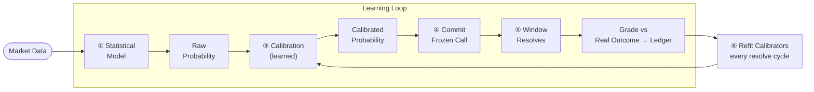
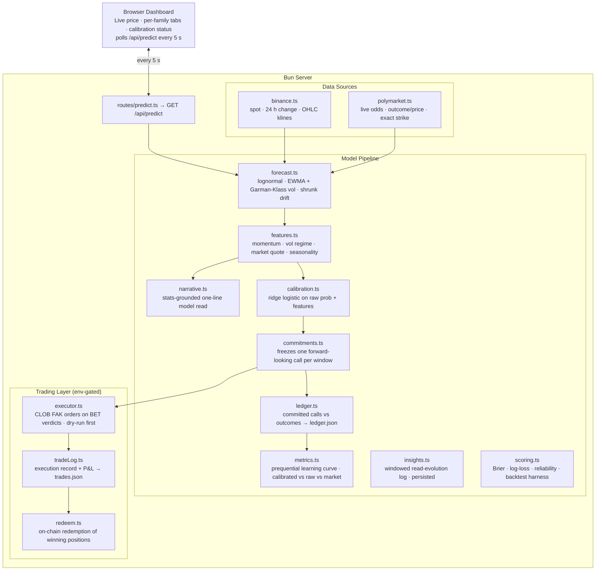

# Crypto Predict


## What is Crypto Predict?

A self-calibrating forecasting engine for near-term crypto direction, rendered
on a live dashboard. It reads spot prices from the Binance public API — the same
data the mirrored Polymarket markets settle against — and produces a probability
of **Up** vs **Down** for each market family, a price-to-beat, and a price
forecast with a confidence band.

What sets it apart from a one-shot predictor is the **learning loop**: every call
is committed early, frozen, graded against the real market outcome, and fed back
into a calibration layer that continuously corrects the model's confidence and
bias. The system measurably improves as it accumulates outcomes.

It mirrors five recurring Polymarket families across **six crypto assets**
(BTC, ETH, SOL, XRP, DOGE, BNB — every asset Polymarket runs up/down markets
for, all sharing the same window boundaries and slug patterns):

| Family     | Horizon                  | Settles on                                |
| ---------- | ------------------------ | ----------------------------------------- |
| **5 min**  | rolling 5-minute window  | Chainlink \<asset>/USD                    |
| **15 min** | rolling 15-minute window | Chainlink \<asset>/USD                    |
| **Hourly** | top-of-hour window       | Binance \<asset>/USDT 1h candle           |
| **4 hour** | epoch-aligned 4h window  | Chainlink \<asset>/USD                    |
| **Daily**  | noon-ET to noon-ET       | Binance \<asset>/USDT 1m close at noon ET |

A top-level dropdown switches the dashboard between any single asset and
**All** — a holistic view with per-asset spot mini-cards and every asset's
call/bet for the selected window family. Each asset gets its own calibrators,
committed calls, and ledger rows (`?crypto=` filters every data endpoint);
`TRADE_CRYPTOS` limits which may real-trade (default `btc`).

The app is fully statistical — no LLM, no API keys. The dashboard's
"model read" is a stats-grounded sentence generated from the same numbers the
model bets on (`src/server/model/narrative.ts`).

## Quick start

```bash
bun install
cp .env.example .env   # optional — runs fine with no keys
bun run dev
```

Open **http://localhost:8333** (Bitcoin's default P2P port). The dashboard
auto-refreshes every 5 seconds.

To seed the learning loop with history so calibration is active immediately:

```bash
bun run backfill       # reconstructs ~288 historical committed calls vs outcomes
```

---

## The learning loop

The core design separates three concerns that a naive forecaster conflates, then
closes the loop between prediction and outcome.



### 1. Statistical core

Log-returns between consecutive Binance candles are modeled as approximately
normal with a small drift $\mu$ and volatility $\sigma$. Over a horizon of $h$
periods the cumulative log-return is $\sim \mathcal{N}(\mu h,\; \sigma^2 h)$, giving:

- **direction / above strike $K$:**

$$P(\text{close} > K) \;=\; 1 - \Phi\!\left(\frac{\ln(K/\text{price}) - \mu h}{\sigma\sqrt{h}}\right)$$

- **price point:** $\text{price} \cdot e^{\mu h}$, with a lognormal 95% band

Two accuracy-oriented refinements, both validated by the backtest:

- **Volatility** is an EWMA of the **Garman-Klass** range estimator (uses
  O/H/L/C), far more efficient and regime-aware than close-to-close variance.
- **Drift is off by default** (`MODEL_DRIFT_SHRINK=0`). Trailing drift is mostly
  noise and biases direction when extrapolated; a driftless random walk scores
  best. A shrink fraction and a diffusion-relative cap remain available to tune.

Short horizons (5m/15m) use per-minute stats from 1m candles; longer horizons use
per-hour stats from 1h candles. See `src/server/model/forecast.ts`.

### 2. Narrative (stats-grounded, no LLM)

The dashboard's one-line "model read" is generated from the model's own
numbers — the lead window's call, spot vs strike, drift, and 24h change
(`src/server/model/narrative.ts`). An earlier LLM-assist layer (small clamped
probability nudge + generated narrative) was removed: its contribution was
unmeasurable against the structural signal, and any consistent bias it added
would have been absorbed by the calibration layer anyway.

### 3. Committed calls vs. the live read

A pure snapshot predictor has a UX and a scientific problem: as a window
approaches expiry the probability of "close above the open" _correctly_ collapses
toward 0 or 1 (it's the delta of a binary option). The number appears to "flip,"
and grading the last pre-close snapshot peeks at where price already landed —
inflating apparent accuracy and yielding a bet you could never actually place.

The engine therefore distinguishes two quantities:

- **Committed call** — a single directional bet locked in _early_ (while the
  horizon is still long), then **frozen** until the window resolves. This is the
  wager we grade and learn from. See `src/server/model/commitments.ts`.
- **Live read** — the probability recomputed each tick, free to converge toward
  the outcome. Shown as a "where it stands now" gauge, clearly labeled.

Commitment timing is governed by `COMMIT_BY_FRACTION` (default `0.2`): a call is
locked in only if the window is first observed within the first 20% of its life,
which in practice is the first refresh after the window opens. Windows first seen
too late to make a genuine forward-looking call are not graded. Open commitments
are hydrated from the ledger on startup, so a restart mid-window keeps its call.

### 4. The learned layer (calibration + direction)

This is what makes the model **get better as it sees more outcomes**. A pure
Platt calibrator is monotone — it can reshape confidence but (almost) never flip
a yes/no call, so it can't learn _direction_. We fit something strictly more
general per family: a small **ridge logistic regression** from the raw
probability **plus frozen commit-time features** to the observed win frequency:

$$\text{calibrated\_logit} = w_0 \cdot \text{raw\_logit} + \sum_j w_j x_j + b$$

The features (`src/server/model/features.ts`), all clamped and vol-normalized:

| Feature                                 | Meaning                                                      |
| --------------------------------------- | ------------------------------------------------------------ |
| `z`                                     | distance-to-strike in vol units (the raw model's own signal) |
| `m15/m60/m240` (`m1d/m3d/m7d` daily)    | momentum at several lookbacks                                |
| `vr`                                    | volatility regime (fast vs slow EWMA log-ratio)              |
| `todSin/todCos` (`dowSin/dowCos` daily) | time-of-day / day-of-week seasonality                        |
| `mkt`                                   | logit of the live Polymarket implied probability             |

- $w_0 < 1$ shrinks overconfidence; $b$ corrects base-rate bias (the old Platt
  behavior, recovered exactly when all $w_j = 0$).
- $w_j$ let the learner discover real directional signal — momentum, regime,
  seasonality, and the market's own quote — so it can **flip a marginal call**,
  not just temper it. This is what gives the daily family (a structural coin
  flip under a driftless model) an actual learned opinion.
- An L2 prior pulls $(w_0, \mathbf{w}, b)$ toward the identity $(1, \mathbf{0}, 0)$: with little
  data the layer is a no-op, and below `CALIB_MIN_SAMPLES` it is strictly off.
- Samples are **recency-weighted** with a per-family half-life
  (`CALIB_HALF_LIFE_HOURS_*`), so a fitted regime bias decays instead of being
  carried forever by dilution.
- Legacy rows without features still train the `(w0, b)` part — missing
  features read as 0, the prior mean.

A deliberate invariant keeps the loop stable: we always store and fit on the
**raw** probability + the **frozen commit-time features**, never the
already-calibrated output. This keeps the training signal stationary as the
learner evolves — otherwise it would compound its own corrections. Every refit
that materially changes a family's weights is appended to
`data/calibrators.jsonl`, so the learner's own evolution is auditable. See
`src/server/model/calibration.ts`.

### 5–6. Resolution and refit

A background loop resolves matured windows against the **real Polymarket
outcome** (Binance close as a fallback), then refits every family's calibrator
from the updated track record — so each freshly settled call immediately
sharpens the next prediction. Calibration status (sample count and the
adjustment applied) is surfaced per family on the dashboard.

### Measuring the learning (not assuming it)

Because each ledger entry's `probUp` was produced by the learner in force at
commit time — trained only on windows resolved _before_ that call — the ledger
is a **prequential (online, out-of-sample) record**. `GET /api/metrics` scores
it three ways per family: the calibrated probability we bet on, the frozen raw
probability, and the market-implied quote. The history page renders this as a
**learning curve** (rolling Brier, calibrated vs raw vs the 0.25 coin-flip
line): if the learned layer is genuinely helping, the calibrated line sits
below the raw line — measured, with no peeking. See
`src/server/model/metrics.ts`.

---

## Seeding the loop: backfill

Calibration needs resolved outcomes, which would otherwise take days to
accumulate (the 1h/1d families especially). `bun run backfill` jump-starts it by
reconstructing historical **committed calls**: for each recent resolved 5m/15m/1h
window it rebuilds the model's raw probability _early_ in the window — exactly
mirroring the live commit timing and using only the candles available at that
instant — and pairs it with the real Polymarket outcome.

The backfill reconstructs short-horizon families from minute candles and
long-horizon families from real hourly candles, so the reconstruction matches the
statistics the live model would have used, with no look-ahead. Each row also
reconstructs the **commit-time feature record** — including the historical
Polymarket implied probability at the decision instant (CLOB price history) —
so the learned layer trains on exactly what the live path would have seen. The
daily family backfills ~180 days by default (it resolves once a day, so live
accumulation alone would take months).

> Backfilled rows reconstruct the statistical model's calls with no look-ahead,
> so treat them as a strong prior, not ground truth.

---

## Track record (ledger)

Every committed call is logged to `data/ledger.json` with its window, strike,
side, confidence, and both the calibrated and raw probabilities. Once the window
closes it is resolved against the real market outcome and scored (Brier / hit
rate, per family).

```
GET /api/ledger    → { summary, entries }
GET /api/metrics   → prequential learning curve: rolling Brier/accuracy,
                     calibrated vs raw vs market, per family
GET /api/insights  → windowed log of how the model's read evolved
                     (persisted across restarts)
```

### Tradable edge (`bun run edge`)

Hit rate vs a coin flip pays nothing — a call only has value if our probability
beats the price the order book would actually fill at (buy Up at the **ask**,
buy Down at **1 − bid**). Each committed call therefore freezes the Polymarket
CLOB **best bid/ask** for the Up token (`marketBidUp` / `marketAskUp`, with
`marketQuotedAt` to audit staleness) alongside the midpoint.

`bun run edge` re-scores the whole ledger against those tradable prices:
simulated P&L/ROI per family at real order-book costs, a half-spread
sensitivity sweep for legacy midpoint-only rows, and a min-edge abstention
sweep (only "take" bets whose model-vs-cost edge clears a threshold). The
real-book section is the verdict; it accumulates from the moment this feature
ships.

**Backfilling tradable prices** (`bun run backfill:book`): the CLOB book has
no history, but executed fills do — Polymarket's trade tape (data-api
`/trades`) proves what each side actually cost. For every legacy row the
script collects fills inside the window's genuine commit span (the first
`COMMIT_BY_FRACTION` of its life, the same rule the live wager obeys) and
takes the **worst** executable price per side, so backfilled costs never
flatter the edge. Rows are marked `bookSource: 'trades'` (vs `'live'` for
real commit-time book snapshots) and every scoreboard reports the split.

### Paper trading (`GET /api/paper`)

The EV decision layer, simulated with no money at risk. Each committed call
gets a frozen verdict (`src/server/model/paper.ts`, surfaced live on the
dashboard and on every range as `paper`):

- **BET** when `edge = P(side) − cost` at the commit-time book clears the
  family's minimum edge (`PAPER_MIN_EDGE_5M/15M/1H/1D`, defaults 2/5/5/5¢ —
  calibrated by the backfilled edge report; `PAPER_MIN_EDGE` overrides all),
  staking fractional Kelly (`PAPER_KELLY_FRACTION`, default ¼) capped at
  `PAPER_MAX_STAKE_FRACTION` (default 5%) of the bankroll;
- **PASS** otherwise — abstention is the discipline that converts calibration
  into profit.

All costs, edges, Kelly sizes, and P&L are **fee-adjusted**: Polymarket
charges a taker fee on every crypto up/down family (1000 bps = 10% as of June
2026; `PAPER_TAKER_FEE_BPS`, and the live executor reads the real rate from
the CLOB per trade). A 50¢ buy effectively costs ~55.6¢ — more than the whole
edge gate — so no decision in the system ever sees a pre-fee price.

Fills are **depth-aware**: each commitment freezes the top order-book levels
_with sizes_, and the replay fills by walking those levels (within
`PAPER_FILL_SLIPPAGE` of the touch) instead of assuming unlimited size at the
best price. Stakes are additionally capped at `PAPER_MAX_STAKE_USD` (default
$50) — market capacity, not risk appetite: without it the compounding bankroll
quickly "fills" sizes a tens-of-dollars-per-level book never held. Legacy rows
without stored depth fill at the touch under the dollar cap and are flagged
implicitly by their age. The summary also reports a **flat-stake scoreboard**
(`summary.flat`, default $10/bet, no compounding) — that is the
extrapolation-safe number; the compounded bankroll is a stress test of the
policy, not a forecast of riches.

The scoreboard is a deterministic replay of this policy over every resolved
ledger entry carrying real commit-time bid/ask (legacy midpoint-only rows are
excluded — they are not bankable evidence). Nothing is stored: the ledger
stays the single source of truth, and a policy change re-scores all history.
The history page renders the equity curve, bankroll, ROI on turnover, max
drawdown, and per-family P&L (starting bankroll `PAPER_START_BANKROLL`,
default $1,000).

### Live trading (`GET /api/trades`) — REAL MONEY

The paper policy, executed for real on the Polymarket CLOB. Off by default and
**dry-run by default even when enabled** — the intended path is enable →
shadow → live. **[TRADING.md](TRADING.md) is the full go-live runbook**
(wallet funding, the USDC.e trap, shadow-mode exit criteria, kill switches);
the short version:

```bash
# 1. Create a DEDICATED bot wallet (never your main wallet), fund it on
#    Polygon with USDC.e (the CLOB's collateral) + a little POL for gas, and
#    set POLYMARKET_PRIVATE_KEY in .env.
bun run trade:setup     # derives CLOB API creds, sets USDC/CTF allowances
bun run trade:check     # same checks, sends no transactions

# 2. TRADING_ENABLED=true (TRADING_DRY_RUN stays true): the full execution
#    path runs — token resolution, live book, edge re-check, sizing — but
#    fills are simulated. Watch the shadow record at /api/trades.

# 3. Only when the shadow record looks right: TRADING_DRY_RUN=false.
```

How an order happens (`src/server/trade/executor.ts`): when a window's
committed call gets a **BET** verdict, the executor re-validates the edge at
the **execution-time ask of the actual token being bought** (not the frozen
commit-time book — an edge that evaporated is not chased), then posts a
marketable-limit **FAK** order capped one tick through the ask, never above
`probability − min edge` and never above the frozen cost plus
`TRADE_MAX_SLIPPAGE`. Sizing is the same fractional Kelly as the paper layer,
against `min(USDC balance, TRADE_BANKROLL_CAP_USD)`, hard-capped at
`TRADE_MAX_STAKE_USD`.

Safety rails, all enforced in code: one trade max per window (persisted in
`data/trades.json`, so restarts can't double-fire), trading only inside the
genuine commit span (`COMMIT_BY_FRACTION`), a family allowlist
(`TRADE_FAMILIES`, default only `5m` — the one family with measured tradable
edge), max concurrently open positions (`TRADE_MAX_OPEN`), and a **daily
realized-loss kill switch** (`TRADE_DAILY_LOSS_LIMIT_USD`, resets at UTC
midnight).

Fills settle against the same resolution loop as the ledger, and winning
positions are **auto-redeemed on-chain** back into USDC every resolve cycle
(`TRADE_AUTO_REDEEM`, EOA wallets only — proxy-wallet accounts claim via the
Polymarket UI). `bun run trade:redeem` catches up manually after downtime.

> The paper record is the evidence; live trading just executes it. If the
> paper equity curve isn't convincingly positive on real commit-time books,
> there is nothing here worth funding.

---

## Strike (price to beat)

Each family's strike matches the venue it settles against, exactly:

| Family   | Resolves on                              | Strike we use                           | Source |
| -------- | ---------------------------------------- | --------------------------------------- | ------ |
| 5m / 15m | Chainlink \<asset>/USD                   | Polymarket `crypto-price` **openPrice** | exact¹ |
| Hourly   | Binance \<asset>/USDT 1h candle          | Binance 1h **open**                     | exact  |
| Daily    | Binance \<asset>/USDT 1m close @ noon ET | Binance 1m **close** at prior noon      | exact  |

¹ The 5m/15m markets settle on the **Chainlink** \<asset>/USD stream — a different
feed than Binance, so a Binance proxy is off by tens of dollars. We read the
exact Chainlink-derived open from Polymarket's API via `fetchPolymarketStrike`;
if that fails we fall back to the Binance 1m-open proxy and flag the strike as
approximate (`strikeIsProxy`).

---

## Backtesting

`bun run backtest` walk-forward tests the direction model on historical Binance
klines, sampling decision points inside each 5m/15m window, and scores it against
the original (full-drift, close-to-close) model and a 0.5 baseline with Brier,
log-loss, and a reliability curve.

```bash
bun run backtest -- --days 5
MODEL_DRIFT_SHRINK=1 bun run backtest -- --days 5   # compare with full drift
```

`bun run backtest:market` additionally scores the model against the **real
historical Polymarket odds** and every blend weight. Latest run: the standalone
model beats the market on both families; a small fixed blend (`w≈0.2`) helps
slightly on 15m and hurts on 5m. We do **not** hard-code a blend — instead the
market quote enters the learned layer as a **feature** (`mkt`), so each family
fits its own market weight from its actual track record and keeps adapting.

---

## Architecture



---

## Configuration (env)

| Variable                                         | Default          | Purpose                                                       |
| ------------------------------------------------ | ---------------- | ------------------------------------------------------------- |
| `MODEL_EWMA_LAMBDA`                              | `0.94`           | EWMA decay for volatility/drift                               |
| `MODEL_DRIFT_SHRINK`                             | `0`              | Fraction of trailing drift retained (0 = driftless)           |
| `MODEL_DRIFT_CAP_SIGMAS`                         | `0.5`            | Cap on drift as a multiple of diffusion                       |
| `COMMIT_BY_FRACTION`                             | `0.2`            | How early a window must be seen to commit a call              |
| `CALIB_MIN_SAMPLES`                              | `25`             | Resolved calls required before the learned layer activates    |
| `CALIB_PRIOR`                                    | `10`             | Shrinkage strength toward the identity calibrator (`w0`, `b`) |
| `CALIB_FEATURE_PRIOR`                            | `10`             | Shrinkage strength pulling feature weights toward 0           |
| `CALIB_HALF_LIFE_HOURS_5M/_15M/_1H/_1D`          | `24/48/168/1440` | Recency half-life per family (hours)                          |
| `TRADING_ENABLED`                                | `false`          | Master switch for the live-trading layer                      |
| `TRADING_DRY_RUN`                                | `true`           | Full execution path with simulated fills (shadow mode)        |
| `POLYMARKET_PRIVATE_KEY`                         | —                | Dedicated bot wallet key (dry-run works without it)           |
| `TRADE_FAMILIES`                                 | `5m`             | Families allowed to trade for real                            |
| `TRADE_CRYPTOS`                                  | `btc`            | Assets allowed to trade for real                              |
| `TRADE_MAX_STAKE_USD` / `TRADE_BANKROLL_CAP_USD` | `10` / `250`     | Per-trade and Kelly-base caps                                 |
| `TRADE_MAX_SLIPPAGE` / `TRADE_MAX_OPEN`          | `0.01` / `4`     | Execution-price and concurrency rails                         |
| `TRADE_DAILY_LOSS_LIMIT_USD`                     | `25`             | Daily realized-loss kill switch (UTC reset)                   |
| `PAPER_TAKER_FEE_BPS`                            | `1000`           | Taker fee assumed by the paper replay (live reads the CLOB)   |

See `.env.example` for the full annotated list.

---

## Development

```bash
bun run dev         # hot-reload server (client rebuilt + live-reloaded)
bun run backfill    # seed the ledger + calibration with historical calls vs outcomes
bun run backtest    # walk-forward score the direction model
bun run typecheck   # TypeScript checks
bun run lint        # ESLint
bun run format      # Prettier
```

> Near-term crypto direction is close to a coin flip, so committed probabilities sit
> near 50% by design and calibration mainly corrects confidence and bias. This is
> a research/forecasting project, not trading advice.
